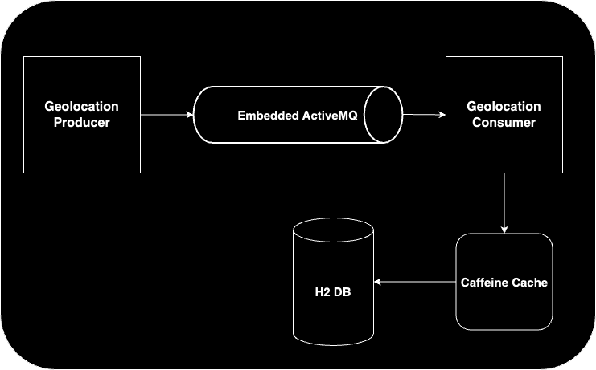

# Courier Tracking App

---
## Getting Started
Clone the repository:
```bash
git clone https://github.com/cmaktas/code-challenge-courier-tracking-app.git
cd code-challenge-courier-tracking-app
```
Build and run with Docker:
```bash
docker build -t courier-geolocation-tracker . && docker run --rm -d -p 8080:8080 --name courier-app courier-geolocation-tracker
```
Stop and remove project related Docker components:
```bash
docker build -t courier-geolocation-tracker . && docker run --rm -d -p 8080:8080 --name courier-app courier-geolocation-tracker
```

## Endpoints
### Swagger UI
Visit http://localhost:8080/swagger-ui/index.html to explore and test the REST endpoints interactively.  

>**Testable Endpoints:**  
**GET** /api/couriers/{courierId}/distance?unit=km — Retrieve total travel distance in kilometers.  
**GET** /api/couriers/{courierId}/distance?unit=mi — Retrieve total travel distance in miles.

### Javadocs 
Automatically generated during the Gradle build and served at http://localhost:8080/docs/index.html.

## Architecture
The Courier Tracking App uses an in-memory H2 database, embedded ActiveMQ, and embedded Caffeine cache. These components are all bundled within the JAR file, so when you build and run the project, the queue, database, and cache are initialized automatically.

Below is a high-level architecture diagram:




## Technologies Used
- Java 21
- Spring Boot (3.4)
- Gradle
- Spring Data JPA (with in memory H2 Database)
- Spring JMS + ActiveMQ (embedded broker)
- Caffeine Cache
- Docker
- Swagger / OpenAPI (for API docs)
- Javadocs (for Java code documentation, served via /docs)

